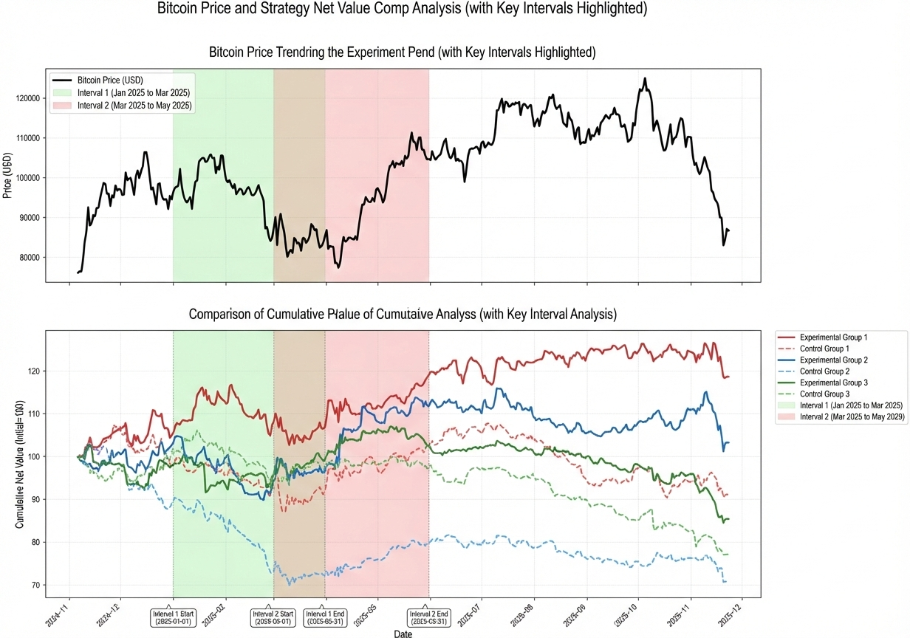
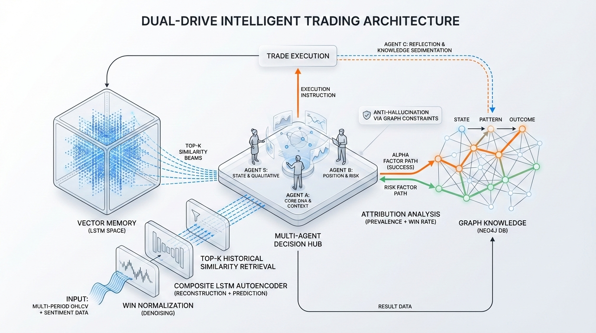
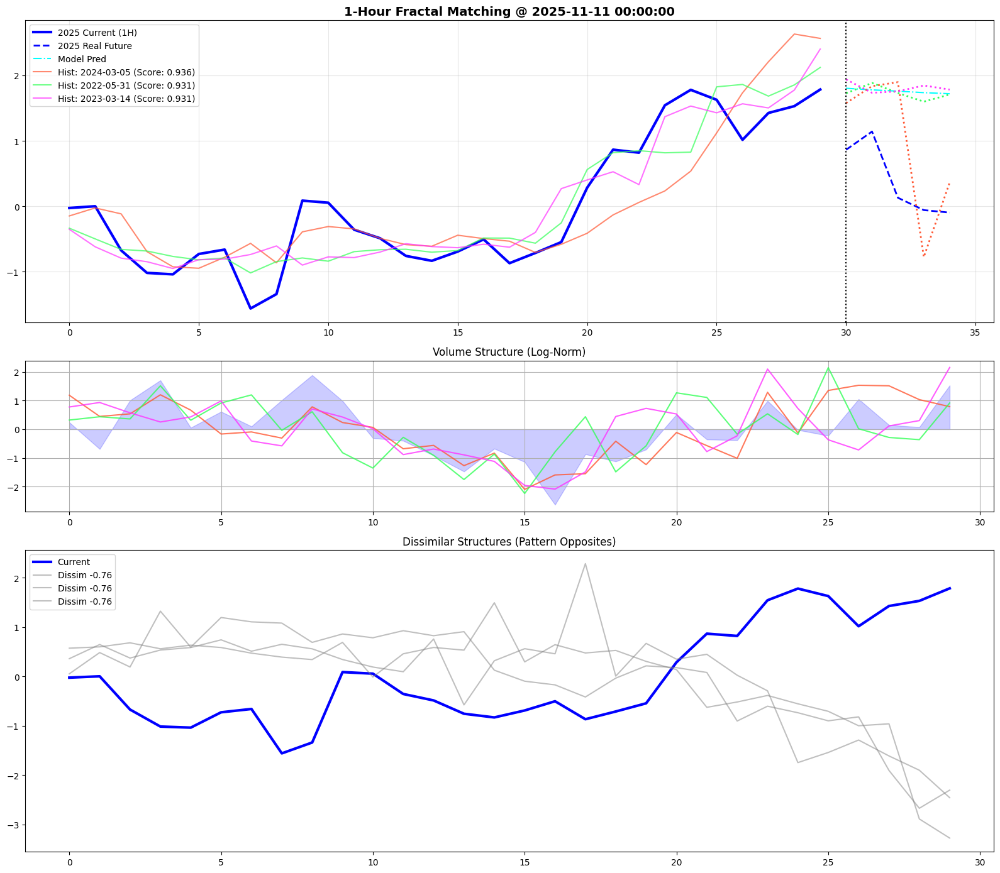
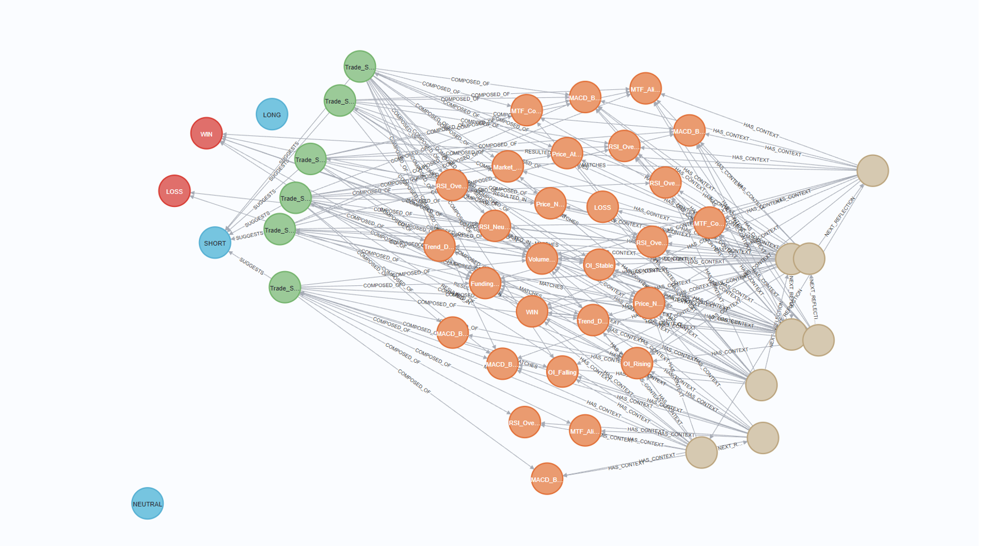

<div align="center">

> **Disclaimer:** This is my first hands-on project. The code structure is, frankly, a mess. Shared here purely for idea exchange — **not recommended for any use. :)**

# QG-ACE: Quant-Graph Adaptive Cognitive Engine

**Memory makes agents earn more. — A trading system where history isn't just recorded—it's weaponized.**

A graph memory system for LLM trading agents. Uses Vector DB (LSTM) + Knowledge Graph (Neo4j) to enable agents to learn from past trades and discover winning patterns. **Agents with persistent memory consistently outperform those without.**

[](https://www.python.org/)
[](https://opensource.org/licenses/MIT/)
[](https://www.backtrader.com/)
[](https://neo4j.com/)

</div>

---

## Does Memory Actually Improve Trading Performance?



*The answer is a resounding yes. Agents with persistent memory (Vector DB + Knowledge Graph) consistently outperform those without.*

---

## System Architecture



*The architecture flows in a closed loop: Market Data → Memory Query → Agent Decision → Execution → Memory Update → (loop back)*

This creates a **learning loop**: every trade improves future decisions.

---


## The Problem: Goldfish Memory Syndrome

Imagine a trader who makes the same mistake a thousand times, never learning from past losses. That's essentially what most trading agents do—they process market data in isolation, making decisions without any historical context.

> **A trading agent without memory is just a very expensive random number generator.**

---

## The Solution: Give Your Agent a Photographic Memory

QG-ACE remembers, analyzes, and improves. Here's the core insight:

> *When an agent remembers what happened last time the market looked like this, it tends to make better decisions.*

### Three Memory Systems

| Memory Type | What It Stores | How It Helps |
|-------------|----------------|--------------|
| **Vector Memory** | 30-period OHLCV embeddings (128-dim) | Find similar historical markets instantly |
| **Knowledge Graph** | Patterns, outcomes, causal relationships | Understand *why* patterns win or lose |
| **Agent Reflection** | Complete S→A→B→C decision chains | Learn from every trade |

---

## Why Quant Trading as an Experiment Ground?

Quantitative trading is an ideal testbed for agent memory research because:

- **Clear feedback loop**: WIN or LOSS is unambiguous — no subjective labeling needed
- **High-frequency data**: Thousands of trades can be generated in months, accelerating learning
- **Perfect isolation**: Market is a controlled environment — no external confounders like user behavior or UI changes
- **Cost of failure is low**: Backtesting lets agents learn from mistakes without real money loss
- **Pattern-rich signal**: OHLCV data contains discoverable structures — perfect for vector similarity and graph attribution

This makes quant trading the perfect laboratory for studying how memory shapes agent intelligence.

---


## How It Works: Three Scenes

### Scene 1: Opening a Position

```
Current Market: "This OHLCV pattern matches something from 3 months ago."

Vector DB: "Found 3 similar events. Average win rate: 67%."

Graph DB: "When this pattern appears with Volume_Spike,
          win rate jumps to 82%. But beware Friday_Afternoon—
          win rate drops to 31%."
```

### Scene 2: Closing the Trade

```
Agent C: "Logging to memory. Pattern: RSI_Divergence_Support_Level
         Outcome: WIN (+2.3%). Key Context: Volume_Spike present."

Vector DB: "Pattern stored. Will be found in future similarity searches."
Graph DB: "Pattern node updated. Attribution refined."
```

### Scene 3: Future Decision

```
Agent: "Ah, I've seen this before. Success drivers are Volume_Spike
       and Bull_Sentiment. Both present. Confidence +15%. Taking the trade."
```

**Result:** No guessing—just collective wisdom from all previous trades.

---

## Proof It Works


The experiment group (with memory) shows:
- Smoother equity curves
- Better risk-adjusted returns
- Improved win rate over time

### Memory Effect Over Time

| Month | Win Rate | Why It Improves |
|-------|----------|-----------------|
| 1 | 52% | Learning phase |
| 2 | 61% | Pattern recognition kicks in |
| 3 | 68% | Memory compounding |

Each trade doesn't just end—it becomes wisdom for the next decision.

---

## Key Features

### 1. Historical Pattern Recognition



LSTM encodes 30-period OHLCV into 128-dim vectors. Similarity > 90% triggers pattern recall.

> **Model Note:** Trained on 15-minute timeframe data over 2 years. Recommend train your own or use pre-trained weights.

### 2. Knowledge Graph Attribution

The triangular closed-loop connects Pattern → Event → Outcome:

```
                    Pattern
                   /        \
         COMPOSED_OF          SUGGESTS
             /                    \
         State                Decision
              \               /
               \   MATCHES   /
                    \       /
                    Event
                    /    \
            RESULTED_IN    HAS_CONTEXT
                 /              \
             Outcome           State
```

**Neo4j Graph Structure (after running):**



**Node Legend:**
- **Red** → Outcome (final trade result: WIN/LOSS)
- **Blue** → Decision (agent's trading decision)
- **Green** → Pattern (composed of specific states)
- **Orange** → State (market state conditions)
- **Brown** → Event (unnamed, actual trade entry events)

This answers three questions:
1. **Why did we trade?** (Pattern → Decision)
2. **What happened?** (Event → Outcome)
3. **What else was going on?** (Event → Context)

### 3. Multi-Agent Decision Chain

| Agent | Role | Output |
|-------|------|--------|
| **S** | Perceiver | What's happening in the market? |
| **A** | Analyzer | What pattern does this match? |
| **B** | Risk Manager | How much to bet? Where's the stop? |
| **C** | Reflector | What did we learn? Writes to memory |

### 4. Complete Audit Trail
Every prompt, response, token usage, and decision rationale is recorded. The `TradeContext` black box freezes the complete mental state at position open.

---

## The Secret Sauce: Pattern Hash + Automatic Deduplication

```
["RSI_Oversold", "Support_Level"]
         ↓
md5("RSI_Oversold_Support_Level")
         ↓
Same states → Same pattern → Merged statistics
```

Whether the agent outputs states in any order, they merge into the same Pattern node. This builds statistical power over time.

---

## Quick Start

```bash
# Install dependencies
uv sync

# Run backtest
uv run python main.py
```

Results saved to `snapshots/<timestamp>/` with complete logs and metrics.

---

## Tech Stack

- **Backtest Engine**: Backtrader
- **Deep Learning**: PyTorch (LSTM encoder)
- **Graph Database**: Neo4j + Cypher
- **LLM**: Qwen via LangChain
- **Data Processing**: Pandas, NumPy

> **Note on Neo4j:** The free version only supports a single graph database, which can be inconvenient for personal experiments when you want to compare different approaches or run multiple backtests in isolation. Consider this if planning extensive experimentation.

---

## License

MIT License — Free to use, modify, and learn from.

---

## The Bottom Line

> *"Give an agent enough memory, and it'll find patterns you'd never spot. Give it a knowledge graph, and it'll explain why those patterns work. Give it reflection, and it improves forever."*

**Memory makes agents earn more.**

---

*For technical docs, see [docs/GRAPH_DATABASE_INTRO.md](docs/GRAPH_DATABASE_INTRO.md) and [docs/COMPLETE_DATA_FLOW.md](docs/COMPLETE_DATA_FLOW.md).*

---
> *Honest note: Using LSTM directly for price prediction might yield better quant results. I admit it. :)*
